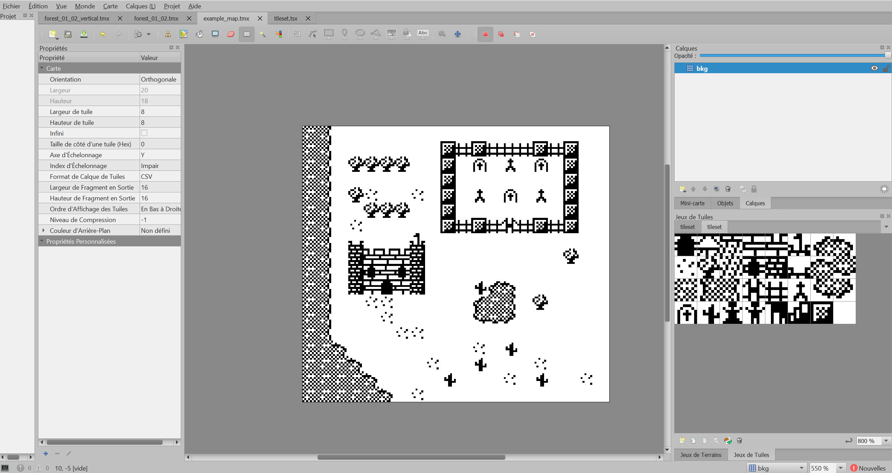

# tmx2gbdk
A python script to convert Tiled's .tmx files and their tileset images to GBDK compatible .c and .h

GBTD and GBMD are great tools to get started quickly with GBDK, but they both have their limitations. 

- they both have a pretty old school file management system
- GBTD only allows you to design "vertical" tilesets, which is confusing when you have horizontal structures
- GBMD is pretty limited when it comes to designing detailed maps
- GBMD zoom options are lacking

Tiled on the other hand offers a lot of editing tools and can present your tileset and map in a more intuitive way.



# Usage
For a specific file:

`python ./tmx2gbdk.py --input your_file.tmx`

If you just want to let it run in the background and recreate your files in real time:

`python ./t2gwatcher.py [folder_to_watch, by default './']`

NB : the file must be in Tiled's default ouput format (tmx). You may use external or embedded tilesets.

NB2: You don't need a tileset/map folders structure like I did. C files are generated next to the original files.

NB3: tileset2gbdk looks at the mean of the RGB values to determine the palette indexes:

- if `(R + B + G) / 255 == 0` it's *white* (0)
- if `(R + B + G) / 255 == 3` it's *black* (3)
- if `(R + B + G) / 255 >= 2` it's *dark gray* (2)
- otherwise it's *light gray* (1)

(no custom palette options yet)

# Example
I included a little map and its tileset so you can see how I configured it for now.

`python ./tmx2gbdk.py -i ./maps/example_map.tmx` will generate the .c and .h of both the tileset and the map. 

`python ./t2gwatcher.py` will continuously regenerate these files as you work on them.

You can see them changing in real time by editing `maps/example_map.tmx` in Tiled or editing `tilesets/tileset.png` in any image editor.

# Tiles Properties
In Tiled you can edit a tileset to add custom properties to each individual tiles.

tmx2gbdk only understands boolean for now but it will generate something like this:

(assuming you added the boolean property `Your_property_name` and enabled it on the first three tiles of your tileset)
```c
#define tilesetYour_property_nameLength 3
const unsigned char tilesetYour_property_name[] =
{
  0x00,0x01,0x02
};
```

# Requirements
- [Tiled](https://www.mapeditor.org/) obviously
- python 3 (originally made with python 3.9.6)
- Pillow for tileset conversion ( `pip install Pillow` )

# Limitations
For now the project is very minimal as I made it for my own needs. Here are the limitation, sorted by likeliness that I solve the issue soon or not.

- doesn't yet allow for memory offset, so your tileset has to be loaded at position 0 with `set_bkg_data`. Will look into it ASAP.
- rather than a "watcher" this script just sleeps 5 seconds then processes the whole folder again, even if there is not a single change in your files. I guess I could at least compare file modification date with the last time the script ended its process.
- only one layer and one tileset should be used, otherwise it might act funny.
- no support for GBC/SGB palettes, I only work with original GB for now but I may look into it later on.
- if your tileset ends with or contains a lot of useless white spaces, no optimization will be made by this script, so you may end up with a lot of useless hex values in your array. Try to make it as compact as possible.
- no support for banks yet, it always sets them to 0. Map properties should solve that issue once implemented.
- unlike GBTD and GBMD it only has ouput for GBDK C format.
- only compatible with the default Tiled format (.tmx maps and .tsx tilesets)

# Todo
Beside the current limitations, I would like to include support for the following:

- map custom properties to be added as preprocessor statements
`#define {map_name}{map_property} {map_property_value}`
- tileset custom properties, not just individual tiles
- allow for one object layer, which could help placing entities on your map
- make it a javascript extension for Tiled, maybe

# Licence
Example tileset created by [Dennis Payne](https://opengameart.org/users/dulsi).
